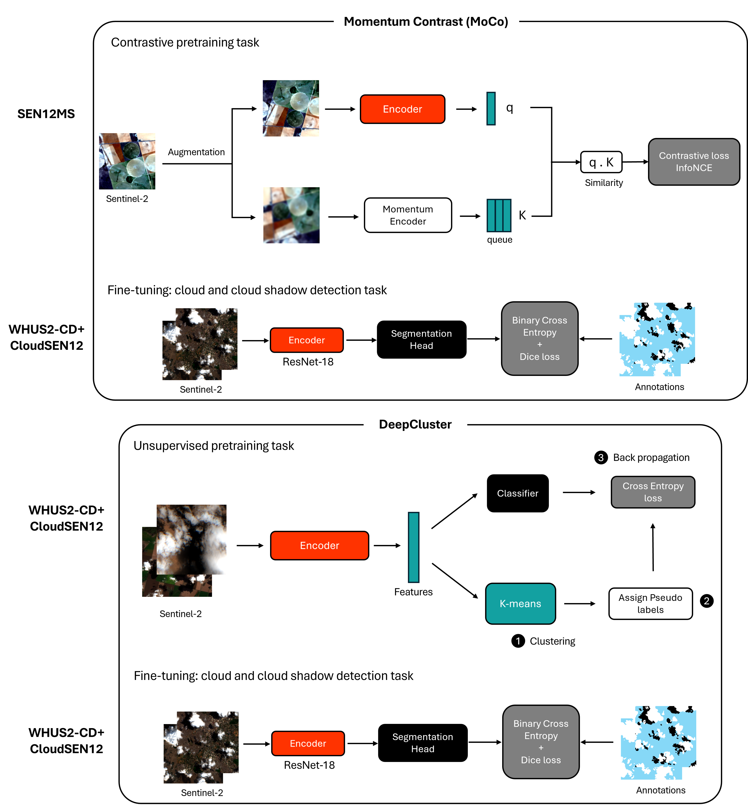
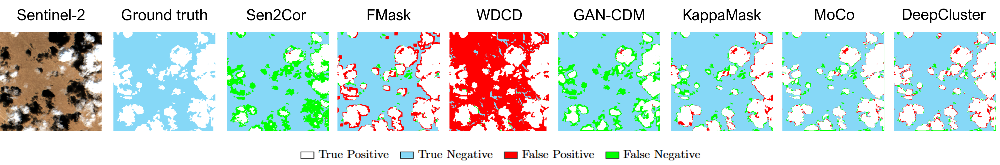

# Self-Supervised Representation Learning for Cloud Detection Using Sentinel-2 images



---

## Overview

This repository provides the code that supports the paper *Self-Supervised Representation Learning for Cloud Detection Using Sentinel-2 images* published in Remote Sensing of Environment. 

**Authors:** *Yawogan Jean Eudes Gbodjo, Lloyd Haydn Hughes, Matthieu Molinier, Devis Tuia and Jun Li*

**[View Our Paper](https://doi.org/10.1016/j.rse.2025.115205)**

In this work, we examine the self-supervised learning paradigm using two computer vision frameworks namely [MoCo](https://openaccess.thecvf.com/content_CVPR_2020/papers/He_Momentum_Contrast_for_Unsupervised_Visual_Representation_Learning_CVPR_2020_paper.pdf) (Momentum Contrast) and [DeepCluster](https://openaccess.thecvf.com/content_ECCV_2018/papers/Mathilde_Caron_Deep_Clustering_for_ECCV_2018_paper.pdf) for the downstream task of cloud detection in Sentinel-2 multispectral images. A ResNet-18 backbone is used as encoder in both frameworks. MoCo and DeepCluster pretext tasks are respectively contrastive learning and clustering based. We pretrained MoCo using Sentinel-2 images from a generic land cover mapping dataset i.e. [SEN12MS](https://github.com/schmitt-muc/SEN12MS) containing no cloudy observations. Unlike MoCo, DeepCluster pretraining consisted of learning to cluster Sentinel-2 image patches from cloud detection datasets namely [WHUS2-CD+](https://github.com/Neooolee/WHUS2-CD) and [CloudSEN12](https://cloudsen12.github.io/) datasets. After pretraining, the ResNet-18 encoder is plugged with a segmentation head (4 layers: 3x3 Conv, Instance normalization, ReLU activation and 1x1 Conv) and the learned representations are fine-tuned to perform the cloud detection using various fractions of annotations. Obtained results on both WHUS2-CD+ and CloudSEN12 datasets show that the proposed methods surpassed industry standards (F-Mask, Sen2Cor), weakly supervised methods and even some fully supervised methods using only 25% of annotations for fine-tuning.



## Getting started

This section will walk you through setting up the environment and running the code.

### Installation
1. **Clone the repository:**
   ```bash
   git clone https://github.com/eudesyawog/self-supervised-cloud-detection.git
   cd self-supervised-cloud-detection
   ```

2. **Install the dependencies:**
   ```bash
   # Create a new environment e.g. a virtual environment
   python -m venv /path/to/new/virtual/environment
   source /path/to/new/virtual/environment/bin/activate 
   
   # Install all required packages
   pip install .
   ```

### Dataset preprocessing

Download and uncompress the 3 datasets (SEN12MS, WHUS2-CD+ and CloudSEN12) into your local repository. Download links can be found in the respective Github repositories provided in the section [`Overview`](#overview).  Additionnaly, you will need to split the Sentinel-2 images of the WHUS2-CD+ dataset into (384 $\times$ 384) patches. To this end, use the code provided [here](https://github.com/zhumorui/Sentinel2_L1C_Preprocessing_Tools).

### Running the code

Examples are provided in the notebook `pretraining.ipynb` and `finetuning.ipynb` on how to perform *pretraining* and *fine-tuning* of MoCo and DeepCluster for cloud detection using the datasets. 

## Citation 

If you use MoCo and DeepCluster for cloud detection in your research, please cite the paper:

```bibtex
@article{Gbodjo2026,
title = {Self-supervised representation learning for cloud detection using Sentinel-2 images},
author = {Yawogan Jean Eudes Gbodjo and Lloyd Haydn Hughes and Matthieu Molinier and Devis Tuia and Jun Li},
journal = {Remote Sensing of Environment},
volume = {334},
pages = {115205},
year = {2026},
issn = {0034-4257},
doi = {https://doi.org/10.1016/j.rse.2025.115205},
url = {https://www.sciencedirect.com/science/article/pii/S0034425725006091},
}
```

## Contact
If you have any questions or feedback regarding the code, please feel free to reach out to jean-eudes[dot]gbodjo[at]vtt[dot]fi.

